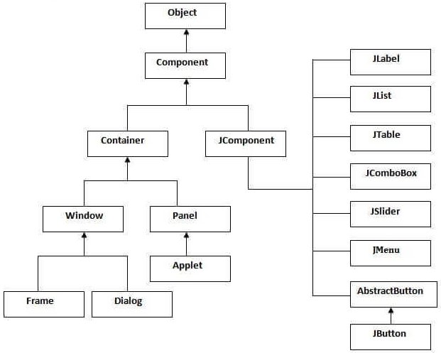

# Animation Findings

> Covered in this file is the basics of animation using Java AWT and Java Swing, and code styles that should be adhered to when writing animation software.

## Differences between Java AWT and Java Swing

| Java AWT | Java Swing |
|----------|------------|
| Components are platform dependant | Components are not platform dependant |
| Components are heavyweight | Components are lightweight |
| Doesn't support pluggable look and feel | Supports pluggable look and feel |
|Provides less components than Swing|Provides more components|
|Doesn't follow the MVC (Model, View, Controller)|Does follow MVC|

> MVC = Model represents the data, view represents presentation, and controller acts as an interface between model and view.

The Java Swing API hierarchy is given below:

Components can be created using association (`new JFrame()`) or inheritance (`Class Sample extends JFrame`).

**There are quite a few components included in Java Swing that we won't be implementing until a later date (ie. `JButton`, `JTextField`). For now we will be looking at Java Swing's painting function.**

The most common way to create a GUI from scratch is to create a `JFrame` either by inheritance or by association, and then add to it, using `frame.add(x)`.

## Java Swing Components

**JPanel:**

- The simplest container class.
- Provides space in which the application can attach *any* other component.

**JFrame:**

- Works as the main window where other components are added to it.
- Has the option to hide or close the window.

**JComponent:**

- The base class for all Swing components except top level containers.
- JComponents are contained within JFrames, not the other way around.

**JScrollPane:**

- Used to make a scrollable view of a component.
- Useful for components whose size may change dynamically.
- May be useful to us when dealing with large environments.
- The component to be scrolled must be created first, and then *made* to be a JScrollPane. ie. Create `JTextArea` object, then create `JScrollPane` object, passing `JTextArea` as an argument to `JScrollPane`.

## Painting

- Begin by delegating the painting to a specific method, and use an instance of `Graphics2D` in order to draw.
- To paint, you should extend the component and the `paintComponent()` method of the component should be overwritten in order to add your own paint/draw function to it. `paintComponent()` can keep its original functionality by inheriting from its parent.
- The `repaint()` method of a component calls the `paintComponent()` method, hence the need to `@Override paintComponent()`.

## Animation Using Java Swing

There are two options in order to animate using Java Swing:

1. Execute a task at specified intervals.
2. Animate inside a thread, using a loop, calling `cycle` and `repaint`.

The second option (Threading) gives the most accurate timing solution.

The order of running with threading animation is:

1. JFrame created, its size is determined by its nested components.
2. Nested JPanel created and its size is set.
3. JPanel is added to its parent JFrame, and the `addNotify()` method is invoked upon being added.
4. `addNotify()` spawns a thread and starts the animation cycle loop.
5. When the thread is spawned, it calls the `run()` in the same class (this class must implement `Runnable`). The `run()` method contains the animation cycle loop.
6. Each time this animation loop is run, the new position of the object being painted is calculated, and the `repaint()` method is run, causing the window to be updated.