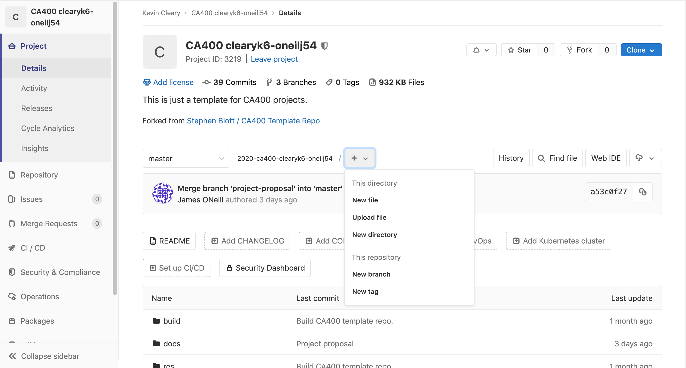

# Tagging and releasing

## Versions

**1.X.X** - A major release, when a set of features have been developed, tested and are fully ready for deployment.

**X.1.X** - A minor release, when a single feature has been developed, tested and is fully ready to be deployed.
 
**X.X.1** - A bugfix, no new features, just performance fixes or enhancement.

## Tagging

1. Create a branch for tagging, using the versioning info above. Example: `git checkout -b 'tag-vX.Y.Z'`
2. Open the file in the project's parent directory containing the version and change it to the new tag version.
3. Update the changelog.md, or add one if necessary. The format is based on [Keep a Changelog](https://keepachangelog.com/en/1.0.0/).
4. Create a commit message using the following format: `vX.Y.Z`.
5. Now change the version to the next snapshot and commit with a message in the following format: `vX.Y.Z-SNAPSHOT`. **Don't squash these two commits.**
6. Now push this branch which should have 2 commits. Example: `git push origin tag-vX.Y.Z`.
7. Create a merge request to master using Gitlab.
8. Once merged, go to the commits page for the project's upstream repo and select the commit that contains the tagged version, **not the SNAPSHOT commit, but the vX.Y.Z commit.**
9. Copy this commit's SHA and return to the repo's main page. 
10. Select the 'New tag' tab (which should be located in the '+' dropdown). 
11. Fill in the version of the tag in the format `vX.Y.Z` and enter the commit SHA of the commit to tag.
12. The tag will now be created and can be pulled down into your local repo by fetching (`git fetch origin`).