# Modelling an Ant Colony

Technical Guide

Kevin Cleary - 16373026

James O'Neill - 16410652

Date: 

___

## Table of Contents

1. [Motivation](#1-motivation)
2. [Research](#2-research)
    - [Swarm Intelligence](#21-swarm-intelligence)
    - [Ant Colony Optimisation Algorithm Overview](#22-ant-colony-optimisation-algorithm-overview)
    - [Ant Colony Optimisation Algorithm Metaheuristic](#23-ant-colony-optimisation-algorithm-metaheuristic)
        - [ConstructAntSolutions](#231-constructantsolutions)
        - [DaemonActions](#232-daemonactions)
        - [PheromoneUpdate](#233-pheromoneupdate)
    - [History of popular ACO Algorithms](#24-history-of-popular-aco-algorithms)
        - [Ant System](#241-ant-system)
        - [Ant Colony System](#242-ant-colony-system)
        - [MAXMIN Ant System](#243-maxmin-ant-system)
    - [Adaptions to Ant Colony Optimisation Algorithm](#25-adaptions-to-ant-colony-optimisation-algorithm)
3. [Design](#3-design)
    - [Ant Colony Optimisation](#31-ant-colony-optimisation)
        - [Moving Around The Given Environment](#311-moving-around-the-given-environment)
        - [Leaving Scent Trails (Pheromones)](#312-leaving-scent-trails-pheromones)
        - [Avoiding Obstacles](#313-avoiding-obstacles)
    - [Visual Display of the Algorithm (GUI)](#32-visual-display-of-the-algorithm-gui)
4. [Implementation](#4-implementation)
    - [Ant Colony Optimisation (ACO) Algorithm](#41-ant-colony-optimisation-aco-algorithm)
        - [`AntColonyOptimisation` Class](#411-antcolonyoptimisation-class)
        - [`Node` Class](#412-node-class)
        - [`NodeGroup` Class](#413-nodegroup-class)
        - [`Ant` Class](#414-ant-class)
        - [`PerformanceLogger` Class](#415-performancelogger-class)
    - [Visual Display of the Algorithm](#42-visual-display-of-the-algorithm)
        - [`AntEnvironment` Panel](#421-antenvironment-panel)
        - [`RunnerControlPanel`](#422-runnercontrolpanel)
        - [`StatusPanel`](#423-statuspanel)
        - [`VariableControlPanel`](#424-variablecontrolpanel)
        - [`ObstaclePanel`](#425-obstaclepanel)
    - [Scenarios](#43-scenarios)
        - [Scenarios GUI](#431-scenarios-gui)
        - [`Scenario` Class](#432-scenario-class)
    - [Displaying Test Results using the Elastic Stack](#44-displaying-test-results-using-the-elastic-stack)
5. [Sample Code](#5-sample-code)
6. [Problems Solved](#6-problems-solved)
    - [6.1 Adapting to nature of problem](#61-adapting-to-nature-of-problem)
    - [6.2 Determining the Optimum Solution](#62-determining-the-optimum-solution)
    - [6.3 Animation](#63-animation)
    - [6.4 Structure of UI](#64-structure-of-ui)
    - [6.5 Setting up the Elastic Stack](#65-setting-up-the-elastic-stack)
7. [Results](#7-results)
8. [Future Work](#8-future-work)
9. [Acknowledgements](#9-acknowledgements)

___

## 1. Motivation

Our work on this project was inspired by previous explorations into genetic algorithms and the use of biomimicry in technology. 

In the past, Ant Colony Optimisation (ACO) algorithms have been utilised to solve defined shortest route problems, most notably the Travelling Salesman problem. This has been relayed and reflected in real world applications such as the design of traffic systems. We wanted to adapt this use case and explore the capabilities of an Ant Colony Optimisation in an environment where not every destination had to be visited, but rather find the shortest path between two locations. This would require a deep understanding of previous ACO algorithms to see where changes could be made to optimise a new algorithm specific to this environment.

We were motivated by a real life ant colony's ability to use pheromones to find their food sources, and adapt their routes quickly when an obstacle would block their original route. We explored how to make our algorithm 'recalibrate' and create a new shortest path if an obstacle blocked the initial path.

This project allowed us to gain a deeper understanding of the process behind developing a genetic optimisation algorithm -  a field we had an interest in. We put into practice the use of a defined test case where we knew what the optimum length was in order to test the quality of our algorithm. We researched previous probabilistic equations that such algorithms use to learn and choose paths to their benefit, what constants should be used in such equations and the values of these constants.

___

## 2. Research

### 2.1 Swarm Intelligence

Ant Colony Optimisation Algorithms examplify **Swarm Intelligence** (SI).
> Swarm Intelligence: The discipline that deals with natural and artificial systems composed of _many individuals_ that coordinate using _decentralized control_ and _self organizaion_. 

Swarm intelligence focuses on the collective behaviours that result from the local interactions of all the individuals within a system with each other and their environment. In this case we focus on the behaviour of individual ants within a colony as they search for food. 

A typical SI system has the following properties:

- Composed of _many individuals_
- Individuals are relatively _homogeneous_ (they are either all identical or belong to a few typologies)
- Interactions among the individuals are based on _simple behavioural rules_ that exploit _only local information_ that the individuals exchange directly or via the environment (**stigmergy**)
- Overall behaviour of the system results from the interactions of individuals with each other and with their environment - group behaviour _self organizes_.

Swarm intelligence can be split up into **Natural** and **Artificial** research:

- Natural SI research studies biological systems; as well as ants, the behaviour of schools of fish, flocks of birds, termite colonies and herds of land animals are all examples of Natural Swarm Intelligence. 
- Artificial SI focuses on human artifacts eg multi-robot systems.

Swarm intelligence is also divided into two streams; **Scientific** and **Engineering**:

- Scientific stream involves modelling swarm intelligence systems to single out and understand the mechanisms that allow a system as a whole to behave in a coordinated way as a result of local interactions.
- Goal of Engineering stream is to exploit the understanding developed by the scientific stream in order to design systems able to solve problems of practical relevance.

This project is in a **Natural** field, and is based around **both streams**; we are studying the effect of the local individual-individual and individual-environment interactions of our simulated ants on the behaviour on our colony system as a whole, while also applying our resulting algorithm to a real-world route recalibration application.  

### 2.2 Ant Colony Optimisation Algorithm Overview

> Ant Colony Optimisation is a **population-based metaheuristic** that can be used to find approximate solutions to difficult optimization problems.

In ACO, a set of software agents called **artificial ants** search for good solutions to a given optimization problem. To apply ACO, the optimization problem is typically transformed into the problem of _finding the best path on a weighted graph_. The artificial ants (referred to henceforth as 'ants') incrementally build solutions by moving on the graph. The solution construction process is **stochastic** and is biased by a **pheromone model**, that is, a set of parameters associated with graph components (either nodes or edges) whose values are modified at runtime by the ants.

The **Construction Graph**, or Construction Matrix, is the virtual space in which the ants travel. The ants make probabilistic decisions based on pheromone concentrations at each point in the construction matrix.

An ACO is usually used to tackle a **Combinatorial Optimisation Problem** (COP). Marco Dorigo (IRIDIA 1997) defines the COP as a triplet _S_, _Ω_, _f_ where:

- _S_ is a **search space** defined over a finite set of discrete decision variables
    - a set of discrete variable _Xi_, _i_ = 1, ..., _n_ with values _v_ji ∈ _D_i = {v1i, ..., vi|Di|}, is given
    - Elements of _S_ are full assignments; in which each variable _X_i has a value vji assigned from its domain _D_i.
- _Ω_ is a **set of constraints** among  the variables
    - Set _SΩ_ is given by the elements of _S_ that satisfy all constraints in the set _Ω_
- _f_ : _S_ → _R_+0 is an **objective function to be minimised**.
    - as maximising over _f_ is the same as minimising by _-f_, any COP can be considered a minimization problem

A solution s* ∈ _SΩ_ is called the **global optimum** if and _only if_:

- _f_(s∗) ≤ _f_(s) ∀s ∈ SΩ 

Set of _all globally optimum solutions_ denoted by _S*Ω_ ⊆ _SΩ_. Solving a COP requires at least one _s*_ ∈ _S*Ω_.

The **Travelling Salesman Problem** (TSP) is a well known example of a COP.

### 2.3 Ant Colony Optimisation Algorithm Metaheuristic

> In ACO, artificial ants build a solution to a Combinatorial Optimisation Problem by traversing a _fully connected construction graph_.

- Each instantiated decision variable _Xi_ = _vji_ is called a **solution component**, denoted by _cij_. Set of all possible solution components is denoted by _C_.
- The **construction graph** _GC(V,E)_ is defined by associating the components C either with the set of vertices _V_ or the set of edges _E_.
- A **pheromone trail value** τij is associated with each solution component. Allows the probability distribution of different components of the solution to be modelled. Pheromone values are used and updated by the ACO algorithm during the search.
- Ants typically move from vertex to vertex across edges of the construction graph exploiting info provided by the numerous **pheromone trails**, as well as depositing their own.  Δτ, or the **amount of pheromones** deposited depend on the quality of the solution found.

The metaheuristic for an ACO algorithm is as follows:

    Set parameters, initialise pheromone trails

    SCHEDULE_ACTIVITIES
        ConstructAntSolutions
        DaemonActions {optional}
        UpdatePheromones
    END_SCHEDULE_ACIVITIES

The metaheuristic consists of an **initialisation** phase and three **activity** phases executed repeatedly as a schedule of activities. These scheduled activities aren't specified in any given order.

#### 2.3.1 ConstructAntSolutions
- A group of _m_ ants construct solutions from elements of a finite set of available components _C_ = {_cij_}, _i_ = 1, ..., _n_, _j_ = 2, ..., |_Di_|. 
    - A solution construction starts with an empty solution sp = ∅. 
    - At each construction step, current partial solution sp is extended by adding a feasible solution component from the set of feasible neighbours N(sp) ⊆ C.
- The choice of a solution component from N(sp) is done **probabilistically** at each construction step. Below is Dorigo's method where,
    - τij is the pheromone value associated with cij
    - ηij is the heuristic value associated with cij
    - α and β are positive real parameter whose values determine the _relative importance_ of pheromone vs heuristic info

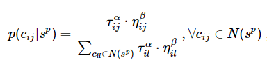

#### 2.3.2 DaemonActions
- Refers to any problem specific/centralised actions that _cannot be performed by a single ant_.
- The most used daemon action consists in the application of **local search** to the constructed solutions: the locally optimized solutions are then used to decide which pheromone values to update.

#### 2.3.3 PheromoneUpdate
- The aim is to increase pheromone values associated with good solutions and to decrease pheromone values associated with bad solutions
- A common approach is to _decrease all pheromone levels_ using pheromone **evaporation** and then _increasing pheromone levels associated with good solutions_ by using **_S_upd**

- 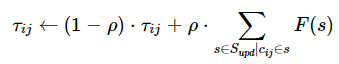

    - Where _S_upd is a set of solutions used for the update, ρ ∈ (0,1] is a parameter for the **evaporation rate** and F:S → R+0 is a function such that:

        ``f(s) < f(s′) ⇒ F(s) ≥ F(s′), ∀s ≠ s′ ∈ S`` 

    - F(.) is commonly referred to as the **fitness function**
- Pheromone evaporation implements a useful form of _forgetting_, favouring new areas in the search space
- This is where different systems tend to branch off from each other eg AntColonySystem (Dorigo & Gambardella) or MaxMinAntSystem (Stützle & Hoos)
- There exist different specifications of Supd, usually a subset of Siter ∪ { Sbs }
    - Siter is the set of solutions constructed from the current iteration of the algorithm
    - Sbs is the best solution found since the first iteration AKA _best so far_
- Example 1: the **Ant System** Update System
    
    - 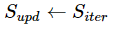

- Example 2: the **Iteration-Best** (IB) Update System

    - 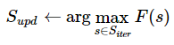

- The IB Update rule contains a much stronger bias towards good solutions than the AS update rule does. This increases the speed of finding a solution but also increases the probability of _premature convergence_.
- An even stronger bias can be found in the **Best-So-Far** (BS) update rule, where Supd is set to { Sbs }
- In practice it is best to use _variations_ of the IB or BS rules which avoid premature convergence to acheive better results than an AS update rule.

### 2.4 History of popular ACO Algorithms

#### 2.4.1 Ant System

Dorigo et. al, 1991-1996

> The Ant System (AS) has virtual ants construct solutions on a construction graph and updates pheromones between components on each iteration.

The first Ant Colony Optimisation Algorithm to be proposed in literature. Pheromone values are updated for _all_ of the ants that have completed the tour. Solution components cij are the edges of the graph and the pheromone update for τij (the pheromone joining nodes i and j) is as follows

- 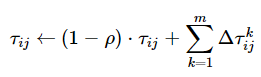

    - ρ ∈ (0,1] is the evaporation rate of pheromone trails
    - _m_ is the number of ants
    - Δτkij is the quantity of pheromones laid on edge (i, j) by ant k
        - 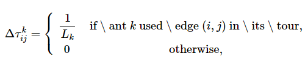
        - where _Lk_ is the tour length of the _k_-th ant 

When constructing their solutions, the ants traverse the construction graph making a probabilistic decision at each vertex. The **transition probability** of the k-th ant moving between nodes i and j is given by:

- 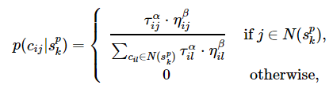
    - N(spk) is the set of components that do not yet belong to the partial solution spk of ant _k_
    - α and β are parameters that control the relative importance of the pheromone versus the heuristic information ηij = 1/dij, where dij is the length of the component cij (ie of edge (i,j))

#### 2.4.2 Ant Colony System 

Dorigo & Gambardella, 1997

> The Ant Colony System (ACS) introduces new random factor _q_ and a local pheromone update rule to diversify solution construction.

First major improvement over the original Ant System. First innovations made in a system known as _Ant-Q_, by the same authors.

 New additions include the form of the **decision rule** used by ants during the construction process. Ants in ACS use the **psuedorandom porportional** rule: the probability that an ant moves from node _i_ to _j_ depends on a random variable _q_ uniformly distributed over [0,1], and a parameter _q0_. If q <= q0 then, among the feasible components, the component to maximise the product of τilηβil is chosen. Otherwise the same equation as AS is used.

This is a **greedy rule** which favours exploitation of the pheromone information, and must be counterbalanced with the introduction of a diversifying component, the **Local Pheromone Update** (LPU). Local pheromone update is performed by all ants after each construction step. Each ant only applies it to the _last edge traversed_.

- 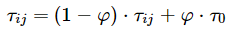
    - Where φ ∈ (0,1] is the _pheromone decay coefficient_ and τ0 is the initial pheromone value.

The main goal of LPU is to _diversify_ the search performed by subsequent ants during one iteration. Decreasing the pheromone concentrations on traversed edges in an iteration encourages other following ants to choose different edges and form different solutions. Local Pheromone Update also means the minimum values of the pheromone are limited.

An **offline pheromone update** is perfomed at the end of the construction process, as in AS. This is performed _only by the best ant_ -  only the edges visited by the best ant are updated according to the following equation

- 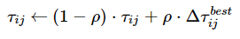 
    - if the best ant used edge (i,j) in its tour, then Δτbestij = 1/Lbest
    - Lbest can be either the length of the iteration best or that of the best-so-far
    - otherwise, Δτbestij = 0

#### 2.4.3 MAXMIN Ant System 

Stützle & Hoos, 2000

> In MAXMIN ant system (MMAS), _only the best ant adds pheromone trails_, and the minimum and maximum values of the pheromone are _explicitly_ limited (AS and ACS are implicitly limited)

The pheromone update equation takes the form

- 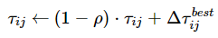
- if the best ant used edge (i,j) in its tour, then Δτbestij = 1/Lbest
    - Lbest can be either the length of the iteration best or that of the best-so-far
- Pheromone values are _constrained_ between τmin and τmax by verifying that each pheromone value after being updated by the ant is within these constraints
- τij is set to τmax _if_ τij > τmax and is set to τmin if τij < τmin
- As in AS but contrary to ACS, the pheromone update rule applies to _all edges_ at the end of an iteration rather than those traversed by the best ants.
- τmin is usually _experimentally chosen_ (Stutzle & Hoos have developed a theory on how to define this value analytically)
- τmax can be calculated analytically _if_ the optimum ant tour length is known
    - for TSP, optimum tour length would be 1 / (ρ ⋅ _L*_) , where _L*_ is the length of the optimal tour.
    - _L*_ can be substitued with _Lbs_ if _L*_ not known

The algorithm sets the initial values of its trails to Lmax and stops when no improvement can be seen for a given number of iterations.

### 2.5 Adaptions to Ant Colony Optimisation Algorithm

The problem we are looking to solve with our system differs from the COPs tackled by the systems described above in various ways. As such, our design and implementation need to differ slightly from these systems based on the requirements of our problem.

The problem we wish to solve is as follows:

> Develop a system modelled on the behaviour of an ant colony to find the shortest route from the Home Node (an 'anthill') to a specified Goal Node (a 'food source') in a matrix, using pheromone value as a determining factor of an ants' trail.

Using the Travelling Salesman Problem (TSP) as a reference for a typical Combinatorial Optimisation Problem, we can identify the following differences:

- In a TSP, the objective is to find the shortest path around an **entire matrix** of differently weighted nodes, attempting to find the shortest path visiting every possible node and returning home. 
    - Our own problem does not require that every node in the matrix is visited, but rather that every ant begins at the same node and should end at the same, sperate node.  
- Following on from this, the solution set of an Ant System solving a TSP comprises of a **list of edges** between pairs of nodes within the construction matrix, and the shortest path is the list with the lowest _sum of values_. 
    - For the purpose of our own problem and also our visual simulation, our solution set will comprise of a **list of nodes**, each equidistant from each of its neighbouring nodes. The shortest path will be the list with the _smallest number of elements_.
- When selecting a new node in all previous ACO systems, ants use a distance heuristic which grows in prominence the closer a solution is to construction. This is based on the number of nodes in the matrix left to be visited. 
    - As our problem does not specify this number of nodes, we have to redefine this distance heuristic. We have decided to base our distance heuristic on the distance from the current ants position from the home node. Our probabilitic function favours nodes further away from the home node.

___

## 3. Design

Our main tasks from the beginning were to (i) create an algorithm that modelled an ant colony's path-finding abilities, and (ii) display how the algorithm works visually. These two tasks defined how the project would be designed, ie. in two parts; the Ant Colony Optimisation, and the Visual Simulation. 

### 3.1 Ant Colony Optimisation

This part of the project was responsible for defining:
- how the ants move around the given environment, 
- how they leave scent trails on the environment, 
- how they avoid obstacles. 

Once all of these are defined, the ants would be able to find the goal from their starting position. 

#### 3.1.1 Moving Around the Given Environment

In our project, unlike other path-finding algorithms, the ants have no prior knowledge of the environment they inhabit. The ants can only see their immediate surroundings, and the pheromone trails present in their immediate surroundings. Similar to simulated annealing, the ants have a certain probability that they will move in a random direction without considering the state of their immediate surroundings. This allows ants to find newer, possibly better paths. 

If the probability of moving in a random direction is not satisfied, then the ant uses their immediate surroundings to determine which direction they will move in. The direction of the next move is influenced by two factors: 

1. The ant's distance from its home, and
2. The amount of pheromones that are present.

If the ant is close to its home, then the direction that leads away from its home is more likely to be chosen. This prevents the ants from doing too much backtracking, and encourages further exploration of the environment. 

If a direction contains a lot of pheromones, then that direction is more likely to be chosen by the ant. This allows ants to learn from other, successful ants. 

In the beginning, there are no pheromones present in the environment, so the distance from the goal is the only influence on the ants' movement. It is only when there are successful ants that pheromone trails become a factor for choosing a direction. This causes the ants to move in a mostly random way for the first iteration of the algorithm. 

#### 3.1.2 Leaving Scent Trails (Pheromones) 

Scent trails or pheromone trails are only present when there has been a successful ant; ie. an ant has reached the goal. Once an ant reaches the goal, the ant colony optimisation algorithm propagates pheromones along the trail of the successful ant. If an ant is unsuccessful in finding the goal by the end of the iteration, then no pheromones get distributed along its trail. 

Each ant starts an iteration with the same number of pheromones, and once an ant reaches the goal, these pheromones get distributed evenly along the trail. This means that the longer the trail, the weaker the pheromones. This ensures that shorter trails receive higher amounts of pheromones, and as a result, are more preferred by subsequent ants. 

#### 3.1.3 Avoiding Obstacles 

The obstacles represent an impasse in the environment. The ants are unable to pass through the obstacles, and this adds another layer of complexity to the simulation. This is where the random movements and pheromones really come into play. If no obstacles existed in the simulation, then ants would be able to find the shortest path to the goal with no issue, as it would just be a beeline from their home to the goal. Instead, they must use random movement to find new paths, or use pheromone trails to guide them in the correct direction. 

### 3.2 Visual Display of the Algorithm (GUI)

The second part of our project was to visually display the algorithm to the user. The visual display of the algorithm is broken down into the following features: 
1. Display the environment,
2. Display the ants' movements throughout the simulation,
3. Allow the user to start, stop, pause, and skip an iteration, and
4. Allow the user to specify various variables in the algorithm for the next time the simulation is run. 
5. Allow the user to add obstacles to the environment. 

These features are useful for understanding how the algorithm works, to test the algorithm, or to use the algorithm to find paths through a given environment. 

___

## 4. Implementation

All of the source code for this project is written in [Java 8](https://www.oracle.com/technetwork/java/javase/overview/java8-2100321.html). We thought that an object oriented design would be the best way to implement both the algorithm and the visual display, having classes for the environment, each ant, etc. Each component of the algorithm needs to hold state throughout the running of the algorithm, so an object oriented implementation seemed the best choice.  

The implementation of our project follows and extends the design, with the two main components being included alongside the means of running the simulation and various scenarios, the means of testing the algorithm, gathering metrics on these tests, and displaying these metrics so that the optimum state of the variables in the `AntColonyOptimisation` algorithm can be found. 

With these extensions to the design, the implementation of the project contains the following:
1. Ant Colony Optimisation Algorithm
2. Visual Display of the Algorithm
3. Simulation & Scenarios
4. Displaying Test Results using the Elastic Stack

### 4.1 Ant Colony Optimisation (ACO) Algorithm

The Ant Colony Optimisation (ACO) algorithm manages the movements of the ants on their journey from the home node, around the environment, and to the goal node. It manages their interactions with the environment, obstacles and scent trails, among many other things. 

The composition of the ACO algorithm can be described using this class diagram:

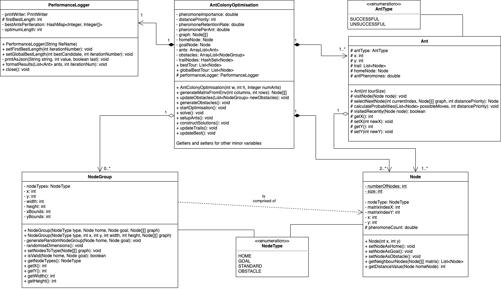

#### 4.1.1 `AntColonyOptimisation` Class

The entirety of the path-finding algorithm is centred around the `AntColonyOptimisation` class, and this class controls and uses the other classes. The algorithm begins by calling `startOptimisation()`, but some initialisation takes place before that. The size, number of ants, home node, goal node and obstacles are all set either randomly or by the user. The environment is created using `generateMatrixFromEnv()`, obstacles are created using `updateObstacles()`, and ants are initialised using `setupAnts()`. The environment consists of a matrix of nodes defined by the `Node` class, and is [explained in more detail below.](#412-node-class) 

After this initialisation, the algorithm is ready to start by calling `startOptimisation()`, as mentioned above. The running of the program is a set of attempts, which are in turn comprised of a number of iterations. The `startOptimisation()` method sets up the environment and the ants for the beginning of each attempt, and contains a `for` loop containing the `solve()` method which runs each attempt. 

The `solve()` method is responsible for running each of the iterations, and setting up the ants for the beginning of each iteration. For each iteration, the `constructSolutions()` method is run, and it utilises the classes `Ant`, `Node` and `NodeGroup` in order to find the shortest path from the home to the goal. As mentioned in [section 3](#3-design), the `constructSolutions()` method calculates the next position for each of the ants in the simulation using (i) the distance from the home node, and (ii) the pheromones present on the nodes surrounding the current node. This process continues until all the ants either find the goal, reach the maximum number of steps that they can take, or run out of nodes to visit. 

Once all the ants have stopped and the `constructSolutions()` method has ended, the pheromones of the ants are dropped onto all the successful ants' trails. All ants have the same amount of pheromones that it can distribute along its trail, and these pheromones are divided evenly among the nodes in the ant's trail. This means that the shorter the trail, the more pheromones are present on that trail, and thus the shorter trail will be more favourable to ants in the next iteration than a longer trail. 

The ants are then reset, and the ants run again on the updated environment containing the pheromones of the successful ants from the previous iteration. 

Between each iteration, each node's pheromones dissipate somewhat. This means that the nodes which are travelled on less often eventually lose all of their pheromones. Only nodes that are travelled on often manage to retain their pheromones, and thus are the only ones that influence the ants over a number of iterations. 

#### 4.1.2 `Node` Class

The `Node` class is responsible for storing information of the environment. As mentioned above, the environment consists of a matrix of instances of the `Node` class. Each instance of `Node` contains information about the current state of that part of the environment, and this information is used to calculate the movements of the ants during the running of the ACO algorithm. Using the `NodeType` enumeration, instances of `Node` can take multiple forms or types, and are treated differently by the algorithm depending on their type. The available types are `HOME`, `GOAL`, `STANDARD` and `OBSTACLE`, and these different types influence how the ants move in the environment. 

During the `constructSolutions()` method of the `AntColonyOptimisation` class, the ants need to know what their neighbour nodes are in order to choose their next move. The `getNeighbourNodes` method is called on the node that the ant is standing on, and it returns all nodes surrounding the current node that are not of type `OBSTACLE`. So in actuality, the ants do not "avoid" the obstacles in the environment, they just aren't given them as an option to move onto. 

The ants also make use of the `getDistanceValue()` method in the `Node` class, which returns the distance from the current node to the home node using the Manhattan Distance formula. This distance value is then used by the ant to choose the next node to move to, with lower distance values being preferred over higher distance values. For a 7x7 matrix of nodes with the home node in the centre, the distance values of the nodes are:

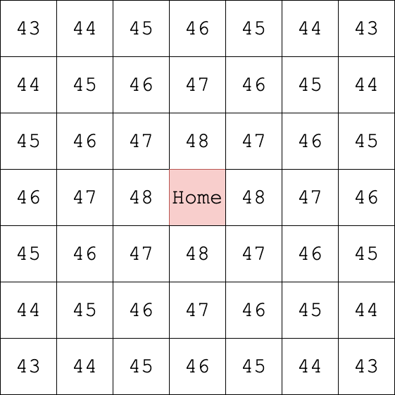

The `getDistanceValue()` method begins with the distance value being the number of nodes in the matrix (in this case it is a 7x7 matrix, so there are 49 nodes), and then it subtracts the Manhattan distance of the current node to the home node from the number of nodes in the matrix to give the distance value. 

#### 4.1.3 `NodeGroup` Class

Just like the `String` type is a collection of instances of `char` in Java, the `NodeGroup` is a collection of instances of `Node`. The exception is that each node in a `NodeGroup` is of the same type. This is how we implemented obstacles in our simulation, as they are a collection of instances of `Node` that are of the `NodeType` `OBSTACLE`.

Grouping instances of `Node` together into one class makes it easier to manage these nodes, as multiple instances of `NodeGroup` can exist, and all the nodes contained in a `NodeGroup` instance can be changed at once if an obstacle is deleted or added. 

When designing the `NodeGroup` class, we decided to make it universal for all node types. This way, if we were to continue our work on this project, we could expand the functionality to contain `NodeGroup` instances of type `GOAL` or `HOME` to further investigate the abilities of our algorithm. 

#### 4.1.4 `Ant` Class

The `Ant` class is responsible for containing the information about each ant in the simulation and for calculating the ant's movements. Each instance of `Ant` represents a single ant, and contains information like the ant's position on the environment, how many pheromones the ant has to spread over the environment, and the nodes that the ant has visited (the ant's trail). 

The ant's movements are calculated using the `selectNextNode()` method. As mentioned before, the selection of the next node is influenced by the ant's distance from the home node, and the pheromones present on the nodes that are surrounding the node the ant is standing on. There is also a small probability that the ant will choose a random node. This is to make sure new routes are found instead of ants being solely influenced by the pheromones and the distance from the home node. 

If the probability of choosing a random node is not fulfilled, then `calculateProbabilities()` method is called within the `selectNextNode()` method. `calculateProbabilites()` returns a list of values for the surrounding nodes. These values are balanced between the ant's distance from the home node, and the number of pheromones present on the nodes they are referring to. Each of these values represents the probability of the ant choosing each respective node surrounding it. The node with the highest value associated with it after running the `calculateProbabilities()` method is chosen as the next node for the ant to visit. 

Once a node is chosen using the `selectNextNode()` method, the ant moves to that node using the `visitNode()` method, which updates the ant's position. 

Each ant, like the nodes, has a type. These types are implemented using the Enumeration class `AntType`, and contains the types `SUCCESSFUL` and `UNSUCCESSFUL`. Each ant starts with the type `UNSUCCESSFUL`, and once an ant reaches the goal node, it's type is changed from `UNSUCCESSFUL` to `SUCCESSFUL`. This type is used by the `AntColonyOptimisation` class to choose which ant trails to drop pheromones onto. 

#### 4.1.5 `PerformanceLogger` Class

The `PerformanceLogger` class was created to gather necessary test data while an instance of `AntColonyOptimisation` is running, format this data and send it to a results file in `res\testresults`. This class makes use of the Java IO `FileWriter` and `PrintWriter` classes.

An instance of `PerformanceLogger` is created upon each Attempt within an `AntColonyOptimisation`, and is passed a `filename` which is comprised of the timestamp of the Algorithm's initialisation and the current attempt number.

When initialised, the `PerfomanceLogger` creates a `FileWriter` with the corresponding `fileName` (as well as setting the `append` argument to `true`) and a `printWriter` taking the `fileWriter` as its argument.

The `PerformanceLogger` class has several methods dedicated to appending data to the `printWriter` at various stages in the ACO Algorithm lifecycle. Each one is passed a number of arguments from the `AntColonyOptimisation` class and arranges them into key: value pairs in a JSON format; designed to be read by the AWS Elasticsearch cluster we are using to aggregate our test data.

The main method included in `PerformanceLogger` is an overloaded method `formatResults()`, which allows different arguments to be passed at each stage in any attempt.

- The initialising `formatResults()` formats data upon initialisation of an `AntColonyOptimisation` instance, including the Attempt Number, Home node, Goal node and Obstacle Co-Ordinates, Pheromone Importance and Distance Priority. This also includes metadata for sending this data to elasticsearch
- During each iteration, `formatResults()` is called with data specific to each ant throughout an iteration, its `SUCCESSFUL` or `UNSUCCESSFUL` type, its trail length and its trail
- At the end of each iteration, `formatResults()` is called with an overview of all ants at the end of that iteration; the number of `SUCCESSFUL` or `UNSUCCESSFUL` ants, the iteration `bestTrail` and its length.
- Once all iterations within an attempt have taken place, `formatResults()` is called with attempt-wide data, including the overall `globalBestTour`, the iteration at which this global best was reached as well as the number of ants which found this globalBestTour.

Once the attempt is complete, the `close()` method is called from `ÀntColonyOptimisation`, and the `printWriter` within the `performanceLogger` instance is closed, with all the data formatted in the newly created JSON results file.

---

The next two components of the project are accessed through the GUI, and allow the Ant Colony Optimisation algorithm to be run in two different ways:
1. Through a visual simulation where every calculation and movement of the algorithm is visualised.
2. Through a scenario, where an environment is set by the user (which we call a "scenario"), and the algorithm is then run multiple times on the same environment, while systematically changing the algorithm variables to different combinations. 

The user can choose between running a visual simulation, or a scenario in the "Simulation Options Window", which is the first window shown to the window, and is displayed below:

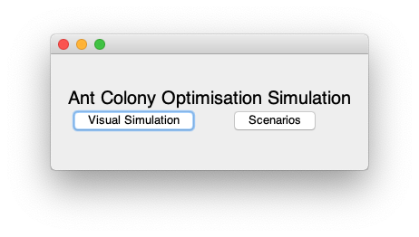

### 4.2 Visual Display of the Algorithm

If the user pressed the "Visual Simulation" button in the simulation options window, then the visual simulation GUI will be shown. The visual simulation GUI is represented by the following class diagram: 

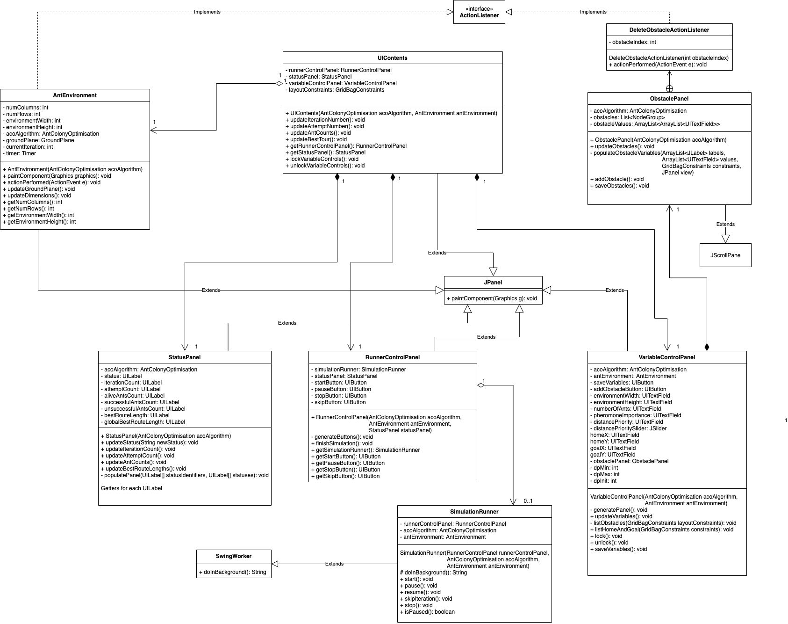

The layout of the visual simulation GUI is shown below, where the coloured boxes represent the different components found in the class diagram above. 

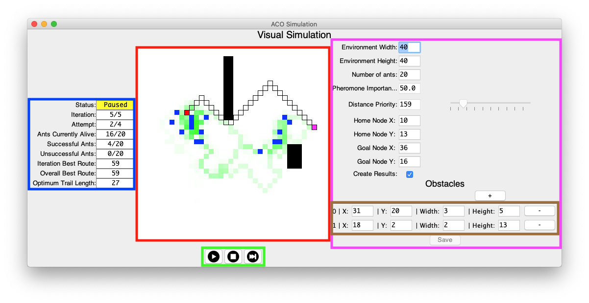

- Red Box: The `AntEnvironment` panel
- Green Box: The `RunnerControlPanel`
- Blue Box: The `StatusPanel`
- Pink Box: The `VariableControlPanel`
- Brown Box: The `ObstaclePanel`

All of these panels are linked together in one window, which is controlled by the `UIContents` class. 

#### 4.2.1 `AntEnvironment` panel

This panel displays the workings of the `AntColonyOptimisation` class visually. It consists of nodes and the ants on those nodes. 

**The Ants:**

The ants in the environment are representative of instances of the `Ant` class, and are displayed on the environment as blue squares. They move around the given environment, with their movements dictated by the `AntColonyOptimisation` class. The `AntEnvironment` updates with each change to each ant's position. Once the ants reach the goal, they disappear from the visualisation as they have completed their task. If they run out of neighbours or run out of steps to take, their colour changes from blue to gray, and they stop moving. 

**The Nodes:**

The nodes/squares in the environment that the ants move over are representative of instances of the `Node` class. The different types that a node can be are also represented on the environment in the following ways: 

- `NodeType.HOME`: Represents the home, where the ants start their journey, and is visually denoted on the environment as a red square. 
- `NodeType.GOAL`: Represents the goal, which the ants need to reach, and is visually denoted on the environment as a magenta square.
- `NodeType.OBSTACLE`: Represents obstacles on the environment, which the ants cannot pass through or stand on, and is visually denoted on the environment as a black square. 
- `NodeType.STANDARD`: Represents a traversable area of the environment, which the ants use to reach the goal, and is visually denoted on the environment as a white square. Standard nodes also display their pheromone count visually by their shade of green. The more green a node is, the more pheromones are present on that node. 
- The optimal trail: The optimal trail is shown as a series of black squares surrounding the nodes which make up the shortest route from the home node to the goal node. This optimal trail is calculated using the Breadth First Search algorithm, and is only one of many possible optimal routes. The ants aim to generate a trail that is of the same length as the optimal trail. 

#### 4.2.2 `RunnerControlPanel` 

This panel allows the user to control the running of the simulation. Using this panel, users can:
 
- Start the simulation running. 
- Stop the simulation. 
- Pause the simulation.
- Resume the simulation when it's paused. 
- Fast-forward/skip to the next iteration. 
 
 When the simulation is fast-forwarded, the ant colony optimisation algorithm still runs to the end of that iteration, it just removes the animation delay, so the algorithm can run at full speed. 

#### 4.2.3 `StatusPanel`

This panel contains all information on the current iteration of the ant colony optimisation algorithm, including:

- Simulation status.
- Iteration number.
- Attempt number.
- Number of ants currently alive in the simulation.
- Number of successful ants.
- Number of unsuccessful ants.
- The best route found in the current iteration. 
- The overall best route found across all iterations and attempts. 

#### 4.2.4 `VariableControlPanel`

This panel allows the user to change the values of specific variables that affect the running of the algorithm. These variables are:

- Environment width.
- Environment height.
- Number of ants.
- Pheromone importance.
- Distance priority.
- Home node X and Y coordinates.
- Goal node X and Y coordinates.
- A checkbox to specify whether or not to gather results on this run of the algorithm. 
- Number of obstacles, each obstacle's X and Y coordinates, width, and height. 

This panel allows different values of variables to be tested, and allows the user to see how each variable changes the working of the algorithm. It also helped us when fine-tuning the algorithm, and allowed us to construct test environments for extensive variable testing. 

The user must click the "Save" button at the bottom of the `VariableControlPanel` in order for the changes they made to the variables to be applied in the next running of the ant colony optimisation algorithm. 

#### 4.2.5 `ObstaclePanel`

This panel is a sub-panel of the `VariableControlPanel`, and allows the user to specify specific coordinates of obstacles along with their widths and heights. When obstacles are added, they are assigned a random X, Y, width and height that are not overlapping the home and goal nodes. The user can then use the `ObstaclePanel` to assign new values to each added obstacle, or remove obstacles as they please. 

---

If the user has checked the box "Create Results", and the simulation has been run to completion or has been stopped by the user, then the "Results Window" will be shown. Here, the user can see all the metrics gathered by the program during the running of the visual simulation. The GUI of the results window is shown below:

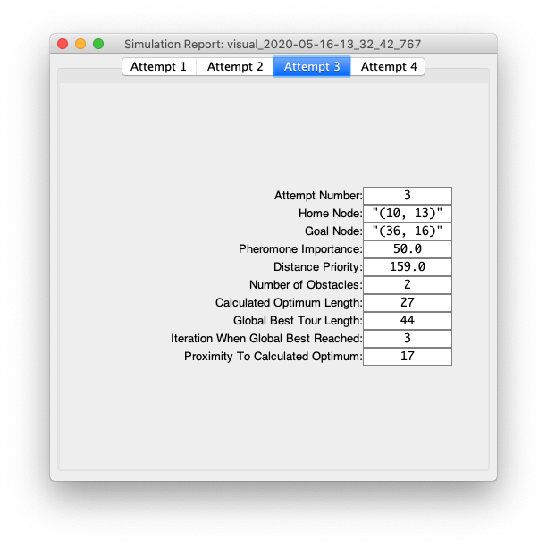

### 4.3 Scenarios

Scenarios allow the user to specify a certain environment to run the algorithm on multiple times while systematically varying the environment variables. 

#### 4.3.1 Scenarios GUI

If the user pressed the "Scenarios" button in the simulation options window, then the scenarios GUI will be shown. A screenshot of the scenarios GUI is shown below: 

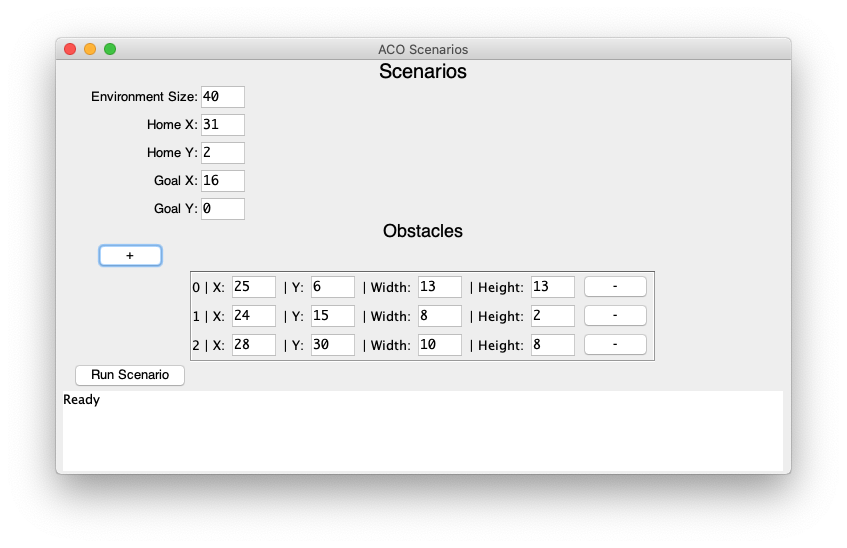

This window allows the user to specify an environment in which many iterations of the algorithm will be run. The user can specify the square environment size (rectangular environments are restricted for scenarios), the home coordinates, the goal coordinates, and the obstacles present in the environment. The same class is used for both the obstacles' specification box in the scenario window, and the corresponding obstacles' specification box in the visual simulation window (which is denoted by the brown box in the visual simulation GUI screenshot). 

Once the "Run Scenario" button is clicked, the window changes to show the status of the current scenario, specifying which range of variable values are currently being tested on the specified environment. The variable values that are changed for each run are: 

1. Pheromone Importance: This value changes in increments of 100, starting at 0 and up to a maximum of 400.
2. Distance Priority: This value changes in increments of 100, starting at 0 and up to a maximum of 800.
3. Number of Ants: This value changes in increments of 20, starting at 10 and up to a maximum of 100.

A screenshot of the scenarios GUI while the scenario is running is shown below:

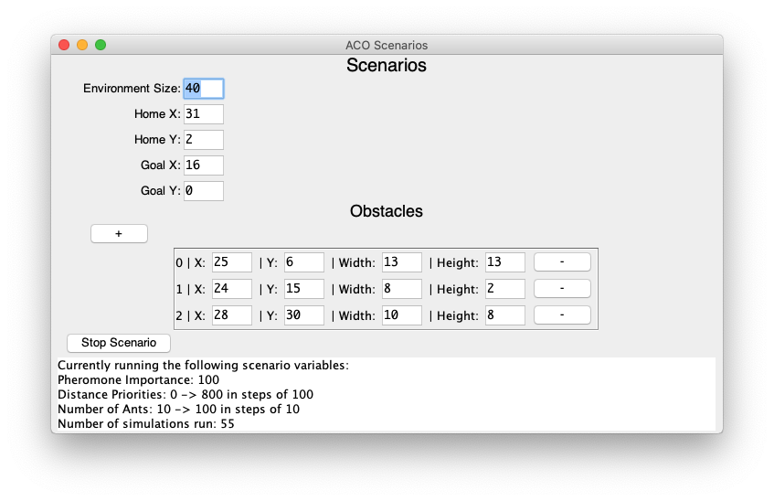

Once the scenario runs until completion, or if the user presses the "Stop Scenario" button, then the results gathered are written to the "res/results/" directory in the project directory. The runtime of the scenario is displayed to the user, and the file location and file pattern of the results file are also shown. 

A screenshot of the scenarios GUI when the scenario has finished running is shown below:

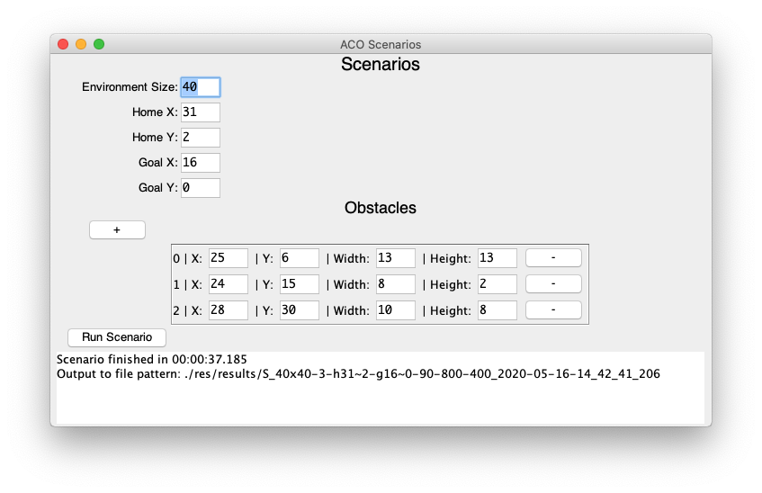

#### 4.3.2 `Scenario` Class

This class is responsible for the testing of the entire `AntColonyOptimsation` and allows extensive running of the algorithm across a given environment, with the environment variables varying between each running of the algorithm. This allows us to gather extensive metrics to examine how the algorithm runs as a whole, and to find out the optimum values of the variables that influence the running of the algorithm. 

For each instance of the `Scenario` class, the `runScenario()` method runs the given environment 225 times while varying the pheromone importance, distance priority and number of ants for each run. The results from each run is collected, and each run's results is stored in its own results file in json format.

### 4.4 Displaying Test Results using the Elastic Stack

We made use of the Elastic Stack for aggregating, displaying and analysing the data gathered while testing our algorithm, in particular the following tools;

- An AWS Elasticsearch cluster to contain, search through and analyse our data
- Kibana plugin to organise and visualise our data
- Filebeat to automate the uploading of our results file to the AWS Elasticsearch cluster

For more information on the elastic stack, visit their documentation [here](https://www.elastic.co/guide/index.html)

Our process for working with this data was as follows:

- Create a results file for every attempt using the `PerformanceLogger` class.
- Configure a locally installed filebeat service to harvest the data from our `./res/results` folder. This would periodically scan this folder and look for any new JSON files present to send to our AWS Elasticsearch cluster.
- Arrange and display the results visually in a Kibana dashboard, a plugin allowing us to analyse the data gathered against each other in a concise way.

___

## 5. Sample Code

___

## 6. Problems Solved

### 6.1 Adapting to nature of problem

Using this ACO algorithm to find the minimum distance between two specified nodes within an open matrix instead of exhaustively traversing a fully connected matrix challenged us to rethink how the algorithm operated without changing the fundamental principles. This also required us to think about the differences between our problem and the traditional ACO problem while researching previous ACO algorithm implementations. 

We had to take the following into consideration:

#### Defining a successful solution

Originally, the solutions constructed within the for a combinatorial problem such as the Travelling Salesman Problem, the goal of each ant was to create a route visiting every node within the construction matrix and then returning to the node at which it started. This is an exhaustive traversal; all solutions are valid and the combined length of each move is used to determine the shortest path.

The ants in this project are not required to visit every node in their graph, rather they all begin at the same node and try to find the same goal node within the graph in as few moves as possible. They are not required to visit every node in their environment, and are considered successful as soon as their trail contains the goal node. Each node is equidistant from all its neighbouring nodes and so the trail with the smallest number of nodes is considered the shortest.

#### Introducing an unsuccessful solution

Following on from our new definition of the successful trail, there now exists a case where an ant runs out of available moves before reaching the goal. In this case, when an ants trail does not contain the goal node, that ant will be considered unsuccessful and it will not apply positive pheromone update to any of the nodes in its trail.

#### Distance Heuristic

In the traditional ACO algorithm, each move made by an ant is determined probabilistically taking into account the pheromone value associated with each candidate node and its distance heuristic; favouring moves closer to the end of the route (i.e the final move, and the "goal" in TSP). As the problem we are trying to solve is trying to find a route to a goal node not known by the ants at the start, the use of the original distance heuristic had to be changed so that it did not rely on the position of the goal node. When addressing this change, we included a distance heuristic favouring nodes further from the home node rather than closer to the goal node, to encourage further exploration of the environment and minimise ants backtracking.

### 6.2 Determining the Optimum Solution

In order to accurately test for the fitness of this algorithm, we needed to determine the optimum solution of any given environment to compare results to. 

We made use of a breadth-first-search traversal that searched the environment exhaustively until the goal node was found. This was implemented as a tree which took the home as the root node and, for each node visited, each of its unvisited neighbours would be included as that current node's children. Once found, the height of the tree between the goal node to the root home node would be taken as the optimum solution.

### 6.3 Animation

When we began the project, we had little-to-no prior knowledge of animation, so we needed to learn the basics of animation, and the basics of animation in Java. We also had no prior knowledge of Java Swing or Java AWT, which are the Java windowing tools. 

In order to overcome this, we took various online tutorials on animation and Java Swing and AWT, and read the documentation on Java Swing and Java AWT. Our knowledge of Java Swing and AWT grew through trial and error, and by the end of this project, we have acquired a good understanding of both animation, and the ways to implement it in Java. 

Another challenge with animation was ensuring that the UI could properly represent the workings of the Ant Colony Optimisation algorithm. This challenge was overcome by representing the environment as a matrix of nodes, and displaying each node as a uniform size in the UI. 

### 6.4 Structure of UI

The way to structure the UI, and the way to transfer data from the Ant Colony Optimisation algorithm to the UI and vice-versa, were unknown to us in the beginning. In order for the simulation to be displayed, all ant positions, obstacle positions, goal and home positions needed to be known to the user interface. 

We accomplished this by ensuring that the project was separated into two components; the Ant Colony Optimisation algorithm and the UI. This way, changes could be made to the UI without affecting the Ant Colony Optimisation algorithm, and both could be scaled independently. 

### 6.5 Setting up the Elastic Stack

While aggregating all the results files within the project, we faced many challenges in setting up an AWS ElasticSearch cluster and harvesting the results folder automatically using Filebeat.

Elasticsearch requires JSON objects to parse and display, but require an index configuration object and an entire JSON object on a single line in order to be recognised by the cluster. In contrast, Filebeat expects to receive text based logfiles that don't automatically recognise and parse JSON objects. We had to configure filebeat to both recognise and extract JSON objects within any result file so that numbers, strings and objects could be treated separately when displaying the data in Kibana. 

___

## 7. Results

___

## 8. Future Work

Having undertaken this project, learning about the Ant Colony Optimisation Algorithm and it's ability in a non-exhaustive problem context, there are a few directions in which this work can be taken forward; both in future research and real world application.

### 8.1 Further Research

The work undertaken here aimed to introduce the ant colony optimisation algorithm to a new problem context - an open plain construction matrix with a single goal to be found rather than a fully connected matrix where each must be visited. This greatly expands the capabilities of the algorithm.

However, for the purpose and scope of this project, the focus was primarily on the use of pheromone trails left by single ants and their impact on the colony as a whole over time. Impacts of the number of ants in a virtual colony and the influence of distance on the success rate of the optimisation algorithm were also studied here. Following on from the work in this project, more unexplored features of real life ant behaviour could be modelled and studied.

In a real-life ant colony, the pheromones laid by each ant can have different 'scents' indicitave of that ant's immediate action or environment. The trails used by the virtual ants here served only positive reinforcement of a path to the goal, but it would be interesting to see what the adverse effect an unsuccessful ant's pheromone trail would have on the performance of the optimisation. These 'negative' trails could alert following ants of nearby obstacles or dead ends. If implementing this, it would be prudent to note that a 'baseline' pheromone value should be associated with each node, and the pheromone evaporation would either decrease back towards this baseline following its use in a positive trail (ie if it is above the baseline pheromone value), or increase towards this baseline should its current value be below due to inclusion in a negative pheromone trail.

To get a more accurate and focused study of the optimisation capabilities of the Ant Colony Optimisation algorithm, the test environments remained the same across all iterations in any given attempt. At the end of each attempt, the iteration at which the best tour was discovered (ie the 'speed' of the optimisation) was recorded, as well as the number of ants to find the best tour on each succeeding iteration (showing the accuracy and consistency of the optimisation). Evaluating these two properties of the ACO algorithm allows further research into another interesting problem; if an obstacle should be introduced blocking the original path to the goal, how long would it take the ant colony to find the next best route? This would rely heavily on the speed and accuracy of the ants, but it would be interesting to see if finding the new route would be quicker as a result of preexisting pheromone trails hinting at the general direction of the goal. This research would feed heavily into the Emergency Response application of this algorithm which is discussed below.

An interesting investigation to pursue following on this project would be on the effect of multiple goal nodes on the behaviour of the ant colony. Having multiple goals of varying distance and direction from the home node would test the ants distribution, whether they balance themselves evenly between both goals or abandon the furthest goal in favour of the closer one which, inevitable, would produce a stronger pheromone trail per ant should the optimum route be found to both. The concept of weighted goals could also be introduced; inspired by the limited resources a piece of food in the real world would offer the colony. How long would it take for the ants to stop being influenced by trails to a goal no longer there? This would allow a lot more focus on the evaporation rate and its use in the `updatePheromones` stage in the ACO algorithm lifecycle. 

### 8.2 Applications

The use of a non-exhaustive search within this project aims to expand the capabilities of Ant Colony Optimisation algorithms and apply it to new real-world cases.

#### Emergency Response

In the past, Ant Colony Optimisation algorithms have been utilised when designing traffic systems. This is suited to the original algorithms as one optimum solution was all that was required. The algorithm and its context in this project have opened up the opportunity to explore the colony's ability to find alternative routes and react to potential environmental changes - not needing to explore its entire environment. One possible application of this new capability would be for route calculation in emergency response vehicles.

Emergency Response teams rely on finding the fastest route to a point of crisis, in a time of crisis. The shortest path in terms of distance may not be the shortest route overall due to traffic or other road blockages. Using the algorithm and environment from this project, we could address this problem by inserting obstacles into the environment and having the virtual colony recalculate a new optimum, as described above in the Further Research section. The system in its highest level could function as follows

- A road network/town plan can be modelled in the existing simulation as a combination of obstacles representing any non-navigable surfaces with the remaining tiles representing roads or accessible routes.
- The system would receive inputs from sources identifying road closures, traffic congestion currently on specific routes, much like current navigation apps use when recalculating traffic routes.
- These inputs would translate into the environment by adding obstacles where complete impasses occur or a reduced pheromone value associated with road nodes carring heavy traffic.
- The ant colony optimisation algorithm could be run in this modelled environment, allowing for real-time introduction of new impasses or traffic statistics being accounted for when updating the pheromones or obstacles on any given iteration

This Use Case is dependant on the effectiveness of the algorithm when responding to changes in environment, but would be very useful to quickly find alternatives on the fly when in need.

#### Educational Resource

The visual nature of this project would lend itself well to an educational tool to showcase the performance of an AntColonyOptimisation algorithm. The use of the variables panel within the `Simulation`, the visual representation of the algorithm and it's route strengths over time allows users to gain a real-time understanding of what values affect the ACO algorithm, and how this algorithm operates along its entire lifespan. The test results gathered can be informative to future study on the Ant Colony Optimisation algorithm and its ability to be adapted into a new context, while including research on previous implementations of the algorithm gives users a full insight into the history and original intentions for the virtual ant colony.

The open plain matrix with a single goal approach would also be an effective environment to showcase the behaviour of algorithms such as A*, which thrive on similar shortest route problems.

___

## 9. Acknowledgements