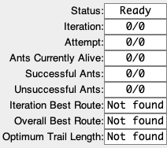

# Modelling an Ant Colony

Technical Guide

Kevin Cleary - 16373026

James O'Neill - 16410652

Date: 16/05/2020

___

## Table of Contents

1. [1. Installation and Setup](#1-installation-and-setup)
    - [1.1 Download Project JAR](#11-download-project-jar)
    - [1.2 Download the `res` folder](#12-download-the-res-folder)
2. [2. User Guide](#2-user-guide)
    - [2.1 Visual Simulation Guide](#21-visual-simulation-gui)
        - [2.1.1 Status Panel](#211-status-panel)
        - [2.1.2 Ant Environment](#212-ant-environment)
        - [2.1.3 Runner Control Panel](#213-runner-control-panel)
        - [2.1.4 Variable Control Panel](#214-variable-control-panel)
        - [2.1.5 Running a Simulation](#215-running-a-simulation)
        - [2.1.6 Changing Variables](#216-changing-variables)
        - [2.1.7 Creating and Changing Obstacles](#217-creating-and-changing-obstacles)
        - [2.1.8 Simulation Results Window](#218-simulation-results-window)
    - [Scenario GUI](#22-scenario-gui)

___

## 1. Installation and Setup

In order to install and set up this project, the following steps must be followed: 

### 1.1 Download Project JAR

Download the project JAR file from the [project source directory](https://gitlab.computing.dcu.ie/clearyk6/2020-ca400-clearyk6-oneilj54), which is named `2020-ca400-clearyk6-oneilj54-1.1.0-SNAPSHOT.jar`. 

### 1.2 Download the `res` Folder

For this project to run correctly, the `res` folder in the [project source directory](https://gitlab.computing.dcu.ie/clearyk6/2020-ca400-clearyk6-oneilj54) must also be downloaded to your local machine and stored in the same directory as the project jar file. 

**Please ensure that the `res` folder and the project's JAR file named `2020-ca400-clearyk6-oneilj54-1.1.0-SNAPSHOT.jar` are stored in the same location otherwise the project will not run.**

### 1.3 Run the Project JAR

Once the JAR and `res` folder have been downloaded to your local machine, if the JAR has been added to your desktop, it can be double-clicked to run, or it can be run using the command line. 

When in the same directory as the project JAR file in the command line, run the following command:

    java -jar 2020-ca400-clearyk6-oneilj54-1.1.0-SNAPSHOT.jar

___

## 2. User Guide

Once you have installed, set up and opened the application, you should be met with the following window.

You can then select one of the two options, and the corresponding window will open. 

### 2.1 Visual Simulation GUI

If you select the "Visual Simulation" button, you will be met with the following screen:

This visual simulation GUI comprises the following components:

#### 2.1.1 Status Panel

This section displays information relating to the current status of the Ant Colony Optimisation Algorithm in progress, which updates in real time throughout each attempt to show the algorithm's performance progress across the ACO lifecycle. Users cannot make edits to the fields in this panel. The panel includes the following fields

##### Status
- Indicates the state of Simulation Runner. 
- Values include `Ready`, `Running`, `Paused`, `Finished`

##### Iteration
- Displays the current iteration in relation to the total number of iterations in the attempt
- Displayed in the format [current iteration] / [#total iterations]

##### Attempt
- Displays the current iteration in relation to the total number of attempts in the algorithm's run
- Displayed in the format [current attempt] / [#total attempts]

##### Ants Currently Alive
- Displays the amount of ants currently active in the present iteration in relation to the total number of ants.
- Active ants refers to ants constructing solutions. Ants that have stopped either due to finding the goal or running out of available moves are not considered active.
- Displayed in the format [#active ants] / [#total ants]

##### Successful Ants
- Displays the number of ants which successfully found the goal node in the current iteration in relation to the total number of ants
- Displayed in the format [#successful ants] / [#total ants]

##### Unsuccessful Ants
- Displays the number of ants which did not find the goal node before running out of available moves in the current iteration in relation to the total number of ants
- Displayed in the format [#unsuccessful ants] / [#total ants]

##### Iteration Best Route
- Displays the length of the best route found in the current iteration so far.
- This value updates when a shorter route is discovered by a new successful ant in the same iteration.

##### Overall Best Route
- Displays the overall best length of any routes found across all iterations within an attempt.
- This value updates when a shorter route is discovered by a new successful ant in any iteration in the same attempt.

##### Optimum Trail Length
- Displays the length of the optimum trail, which is calculated when the simulation is run. 

#### 2.1.2 Ant Environment

This is an embedded window visualising the ant environment with groups of pixels represeting each node in the construction matrix. The Simulation Runner updates with every ant movement within the current iteration to graphically simulate the behaviour of the algorithm. Pixels representing nodes or node groups are color coded to differentiate between elements.

##### White - standard node
- White colored space within the Simulation Runner represents standard nodes. Each such node is a navigable point in the construction matrix i.e an active ant can select and move to this node, making it a part of its trail.

##### Red - home node
- The red coloured node represents the Home Node. This is the point in the construction matrix from which each ant builds it's solution. The first node in each ant's trail, there should be only one in each simulation.

##### Pink - goal node
- The pink coloured node represents the Goal Node. This is the point in the construction matrix each ant is trying to find. Once included in an ant's trail, their solution construction stops and they are marked as successful. There should only be one in each simulation

##### Blue - ants
- Blue coloured nodes indicate the current position of an ant. These will be constantly update and move in steps as the simulation runs. Before the simulation begins for the first time, each ant's position is set to [0,0] by default, and so the node in the top-left corner will appear blue. Once the simulation begins, the ants will reset their initial position to that of the specified home node and begin exploring from there.

##### Black - obstacles
- Groups of black coloured nodes represent obstacles within the ant environment. These nodes are not navigable by any ants within the colony. There can be many obstacles in the one simulation, and each obstacle is represented by one or more nodes grouped together. Obstacles may overlap each other, but will never be allowed to overlap the home or goal nodes.

##### Green (gradient) - Pheromone trails
- Green nodes within the simulation display represent the pheromone trails of the ants across all iterations in an attempt. The gradient of each trail node indicates the strength of the pheromones associated with that node. These are updated at the end of each iteration to show the strength of each trail made across every iteration. Pheromone trail nodes still behave as standard nodes, and may be visited by ants no matter their current strength.

##### Grey - Unsuccessful ant
- If an ant runs out of available moves before reaching the goal node, the ant stops moving and becomes an unsuccessful ant. The position at which an ant terminates it's search unsuccessfully is displayed as a grey coloured node. Other ants may visit these nodes after. All unsuccessful ant markings are displayed for the remainder of the attempt. 

##### Black Squares - Optimum Trail
- The black un-filled squares forming a path between home and goal nodes represent the optimum trail found for this environment. This is displayed throughout the running of the simulation.

#### 2.1.3 Runner Control Panel

This is a user controlled panel situated below the Simulation Runner Display. It is comprised of buttons which, when clicked, alters the state of the current Simulation.

##### Play/Pause button

This button toggles between a play and a pause button. When the simulation is in a `Waiting`, `Stopped` or `Paused` status and the Play/Pause button is clicked, the simulation begins or resumes with the saved variables, as is appropriate. If the simulation is `Running` when the Play/Pause button is clicked, the simulation is paused in its current state, and the status is switched to `Paused`. When `Paused`, no changes may be made to the simulation via the variable control panel, but the simulation will resume from the current point in the aco algorithm should the play button be clicked when the simulation status is Paused.

##### Stop simulation button

This button stops the iteration at its current point. Clicking this button while the simulation is currently `running` will halt the aco alorithm in the background and halt the visual diplay in it's current state, and the status is set to `Stopped`. The simulation will not be resumed from the same point if the play button is clicked following while the status is `Stopped`. The user is able to edit the fields within the variable control panel again once the stop button has been clicked.

##### Next Iteration button

This button acts as a fast-forward button that jumps the simulation display to the next iteration. If clicked while the Simulation is currently `Running`, the current iteration is completed at the algorithms' natural pace and the pheromone trails are updated accordingly, and the next iteration begins at the regular display pace.

#### 2.1.4 Variable Control Panel

This panel, situated to the right of the simulation display runner, allows the user to make changes to variables to be used in the proceeding running of the algorithm. The user may make changes to the fields in this panel when the simulation status is either `Waiting` or `Stopped`, and any changes made will only be passed to the following running of the algorithm when the `Save` button is clicked.

The panel is comprised of the following:

##### Environment Width

This field sets the width for the environment, which increases the number of nodes present horizontally in the simulation. This value is set by typing a value into the field.

##### Environment Height

This field sets the height for the environment, which increases the number of nodes present vertically in the simulation. This value is set by typing a value into the field.

##### Number of Ants

This field sets the number of ants within the Ant Colony. The same, specified number of ants are used in each iteration within each attempt of the algorithm. This value is set by typing a value into the field.

##### Pheromone Importance

This field determines the weight of pheromone strength associated with each node in a single ant's determination of which node to progress to within its solution construction. A higher value means a heavier reliance on pheromones when an ant is deciding its next move. This value is set by typing a value into the field.

##### Distance Priority

This field determines the degree to which an ant favours distance from the home node when picking the next node in its trail. A higher value means an ant will favour nodes further away from the home node when deciding its next move. This value is set using the slider provided; moving the slider to the right increases the Distance Priority level.

##### Home Node Fields

There are two Home Node Fields, `Home Node X` and `Home Node Y`, which are used to specify the X and Y coordinates of the home node respectively. These values are set by typing a value into the field.

##### Goal Node Fields

There are two Goal Node Fields, `Goal Node X` and `Goal Node Y`, which are used to specify the X and Y coordinates of the goal node respectively. These values are set by typing a value into the field.

##### Create Results Checkbox

If this checkbox is checked, then once the simulation has ended, the results of the simulation will be shown to the user in the Results Window, which is generated upon simulation completion. 

##### Obstacle Panel

The Obstacle panel, upon initialisation, displays a `+` button. When clicked, an embedded window displaying extra fields regarding the properties of each created obstacle is displayed, containing an object. The corresponding obstacle will be rendered within the Simulation Display Runner window. Each subsequent click of the `+` button creates a new object, labelled with a number starting from 0. 

When first created, obstacles are assigned random properties, but each can be edited by the user. These properties are as follows:

- **X**: Specifies the X co-ordinate of the _leftmost_ node within the obstacle
- **Y**: Specifies the Y co-ordinate of the _topmost_ node within the obstacle
- **Width**: Specifies the width of the obstacle as a number of nodes. The width extends to the right of the specified X co-ordinate.
- **Height**: Specifies the height of the obstacle as a number of nodes. The height extends downwards from the specified Y co-ordinate.

These values are set by typing a value into the field.

Clicking the `-` button at the end of any obstacle's fields line will delete that object from the panel, and from the simulation. 

##### Save Button

When clicked, all information contained in the fields above is passed on to the Ant Colony Optimisation algorithm used within the simulation.

#### 2.1.5 Running a simulation

To begin a simulation with all current saved variables, left-click the `play` button below the simulation display window. The Status value in the Status panel should change to `Running` and the simulation display should begin showing the ants moving around the environment.

To pause the simulation at any point while a simulation is running, left-click the `pause` button (which will have replaced the `play` button upon initial click). The Status value in the Status panel will change to `Paused`, and the simulation display should freeze all moving ants in their current position. To resume the simulation from the point at which it was paused, left-click the `play/pause` button once again.

To fast-forward the simulation to the proceeding iteration, left-click the `skip iteration` button; the rightmost button in the Runner Control Panel below the simulation display window. Once clicked, the current iteration will finish out at the background algorithms natural pace which will fast-forward the simulation display to the next iteration keeping the trail information of all ants in the current iteration. The simulation will resume it's default slower pace once the next iteration begins.

To stop a simulation completely at any point while a simulation is running, left-click the `stop` button; the centre button within the Runner Control Panel. Once clicked, the Status value in the Status Panel will switch to `Finished`, and the simulation display will freeze with all ants in their current position. Note, the simulation cannot be resumed from the same position once the `stop` button is clicked. Clicking on the `Play` button following this begins a new running of the algorithm.

#### 2.1.6 Changing Variables

Any fields in the Variable Panel, to the right of the main simulation display window, may be edited by the user while the Status is either `Waiting` or `Stopped`. To edit any of the fields with a text box, type a new value into the text box. To change the value of the `Distance Priority` field, move the slider.

To save any changes made in the Variable Panel, left-click on the `Save` button situated at the bottom of the panel.

#### 2.1.7 Creating and Changing Obstacles

The Obstacles Panel is located at the bottom of the Variable Control Panel, and is empty by default. To create an obstacle, left-click on the `+` button. A new obstacle row will be visible in the Obstacle Panel. Each field in the obstacle can be edited by replacing the number in the textbox. 

Left-clicking the `+` button will add more obstacles to the panel. Each obstacle is labelled with a number, starting from 0 and incrementing by 1 with each created obstacle. Left-clicking the `-` button at the end of any obstacle's row will delete that obstacle. 

In order to save created or edited obstacles, left-click the `Save` button. The obstacles should appear as groups of black nodes within the Simulation Display window once the `Save` button is clicked. 

#### 2.1.8 Simulation Results Window

Once the simulation has ended, either by the algorithm completing the final iteration in the final attempt, or by the user clicking the stop button, and the user had checked the "Create Results" checkbox in the variable control panel, then the Results Window is shown. The result window shows all metrics gathered from all attempts of the simulation. 

### 2.2 Scenario GUI

If you select the "Scenarios" button, you will be met with the following screen:

Here, like in the Visual Simulation GUI, the user can specify various environment variables. Once the environment variables have been set and the user presses the "Run Scenario" button, you will be met with the following screen:

Here, the status of the scenario can be seen as it runs the ant colony optimisation algorithm multiple times. You can then either wait for the scenario to finish, or force it to stop using the "Stop Scenario" button. Once either of those events happen, you will be met with the following screen:

This shows you how long it took for the scenario to finish running, and also shows where the corresponding output file has been stored. 